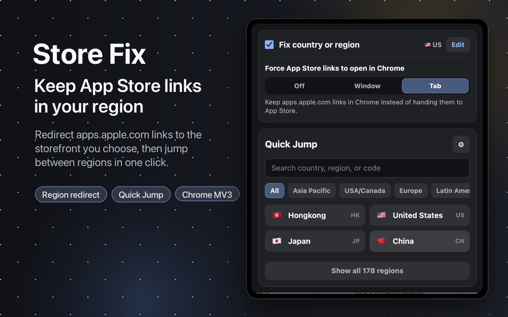

# Store Fix

[English](README.md) | [简体中文](README-zhs.md) | [繁體中文](README-zht.md)

Store Fix 是一個用於修正 App Store 連結地區的瀏覽器擴充功能。它會在你點擊連結或直接瀏覽時改寫 `apps.apple.com` 位址，讓 App Store 頁面保持在你選擇的國家或地區。

Store Fix 支援透過 App Store 安裝 Safari 版本，也支援透過 Chrome 線上應用程式商店或本倉庫手動安裝 Chrome 擴充功能。

## 下載

- App Store：[Store Fix](https://apps.apple.com/cn/app/id6778057096)
- Chrome 線上應用程式商店：[Store Fix for Chrome](https://chromewebstore.google.com/detail/beffnefholkipkcdbphjbcneccckjacf?utm_source=github)
- 手動安裝 Chrome 擴充功能：[建置與手動安裝](docs/BUILD.md)
